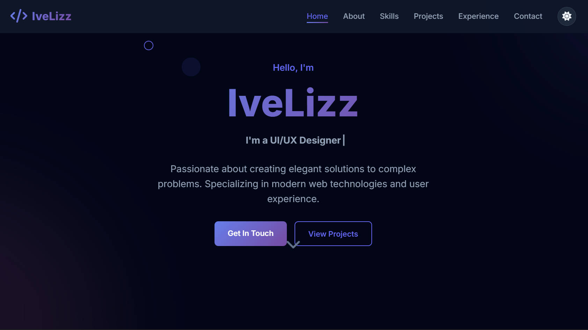

<!--
Credits and references used in this README:

1) Layout ideas and section inspiration:
   https://github.com/abhisheknaiidu/awesome-github-profile-readme?tab=readme-ov-file#descriptive-

2) Skill icons (SVG badges):
   https://github.com/tandpfun/skill-icons?tab=readme-ov-file#icons-list

3) GitHub stats card:
   https://github.com/anuraghazra/github-readme-stats
-->

# arataaXwonyoung
**`Growth Lead at NextWork`** 

## About Me
- Memiliki minat di bidang Web Development (Frontend & Backend)
- Tertarik pada Mobile App Development (Android & iOS)
- Sedang belajar dan mendalami JavaScript/TypeScript, React, dan Flutter
- Memegang prinsip: terus belajar, menulis kode yang rapi, dan senang berkolaborasi
- Sering mengerjakan proyek kecil untuk melatih UI/UX dan API integration
  
## Skill stack

Also comfortable with:
- HTML & CSS (termasuk Tailwind CSS untuk styling cepat dan responsif)
- JavaScript (ES6+) untuk logika dan interaktivitas
- React.js untuk pengembangan antarmuka yang dinamis
- Next.js untuk fullstack development (SSR/SSG, routing, API routes)

---

## Projects - showcase

<table>
  <tr>
    <td align="center" width="33%">
  
   
  <b>Website Coffee Shop</b> 
  Membuat sebuah website coffee shop 
  🔗 <a href="https://github.com/arataaXwonyoung/coffee-web">Repo</a>
  🔗 <a href="https://coffeeshop-template.netlify.app/">Hasil</a>
   
  Tags: Html, Css, JavaScript
</td>
    <td align="center" width="33%">
  
   
  <b>Website Portfolio</b> 
  Membuat sebuah website Portfolio 
  🔗 <a href="https://github.com/arataaXwonyoung/template-porto.git">Repo</a>
  🔗 <a href="https://template-porto.netlify.app/">Hasil</a>
   
  Tags: Html, Css, JavaScript
</td>
    <td align="center" width="33%">
  
   
  <b>Website Sistem Akademik</b> 
  Membuat sebuah website Sistem Akademik 
  🔗 <a href="https://github.com/arataaXwonyoung/sistem-akademik-mhs.git">Repo</a>
  🔗 <a href="https://student-academic-sistem.vercel.app/">Hasil</a>
   
  Tags: Html, Css, Vuejs
</td>
    
  </tr>
</table>

---

## Stats

---

## Links

